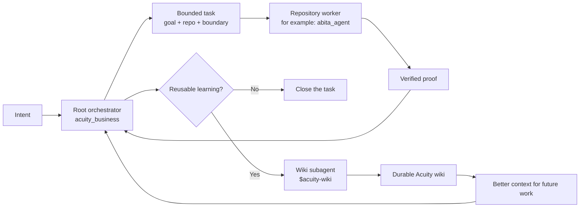

# Acuity Business

> Workers execute. Proof teaches the system.

This repository is the shared operating layer for Acuity Health agents. It
owns global working rules, reusable skills, and the orchestration pattern that
sends bounded work into the right repository and turns verified results into
durable knowledge.

## The closed loop



The root orchestrator remains the owner. Repository workers do the work and
return proof. After verifying that proof, the orchestrator may deploy a separate
wiki subagent using `$acuity-wiki`. The wiki subagent promotes only durable,
reusable learning; a normal task closeout does not automatically become wiki
content.

## Context at each step

### Root orchestrator

A task started in `acuity_business` receives:

- global `AGENTS.md` rules;
- this repository's instructions;
- the user request and current conversation;
- lightweight skill metadata, with full skill instructions loaded only when
  selected.

The root defines done, chooses the target repository, sets the boundary, and
passes only relevant context to the worker.

### Repository worker

A worker deployed to `abita_agent`, `acuity_product`, or another repository
receives:

- the global rules from `acuity_business`;
- the target repository's `AGENTS.md`;
- the target repository's vision when its instructions or task require it;
- the bounded worker prompt;
- relevant skills.

The worker stays inside one workstream and returns status, artifact, proof,
changed files or links, blockers, decisions needed, and a recommended next
step. It does not orchestrate other workers.

### Wiki subagent

The wiki subagent receives the verified closeout, its proof, and the target wiki
location. It uses `$acuity-wiki` to update existing knowledge or create one
small entry. It returns the wiki change to the root for verification.

The promotion gate is strict:

- one run is evidence, not automatically knowledge;
- reusable rules, decisions, procedures, and proven failure modes may enter the
  wiki;
- weak, duplicated, transient, private, or task-local information does not;
- vision and policy changes still require human approval.

## Repository ownership

- `AGENTS.md` — shared hard rules for every agent.
- `skills/orchestrator/` — root routing, worker monitoring, proof, and closeout.
- `skills/acuity-wiki/` — verified proof to durable knowledge.
- `skills/acuity-brand-design/` — Acuity's visual system and exact brand assets.
- `skills/` — other reusable workflows.
- `scripts/` — dependency-light validation helpers.
- `hooks/` — local repository guardrails.

Repository-specific behavior stays in the owning repository's `AGENTS.md`,
vision, code, tests, and operational evidence. This repository coordinates that
work; it does not replace those sources of truth.

## Runtime discovery

The versioned repository is canonical. Codex discovers the shared rules and
skills through runtime links:

```text
~/.codex/AGENTS.md            -> ~/acuity_business/AGENTS.md
~/.codex/skills/<skill-name>  -> ~/acuity_business/skills/<skill-name>
```

## Maintaining skills

Each `skills/<name>/SKILL.md` has YAML front matter with a unique `name` and a
concise trigger-oriented `description`.

Validate after changes:

```bash
scripts/validate-skills
```

Enable the local validation hook:

```bash
git config core.hooksPath hooks
```
