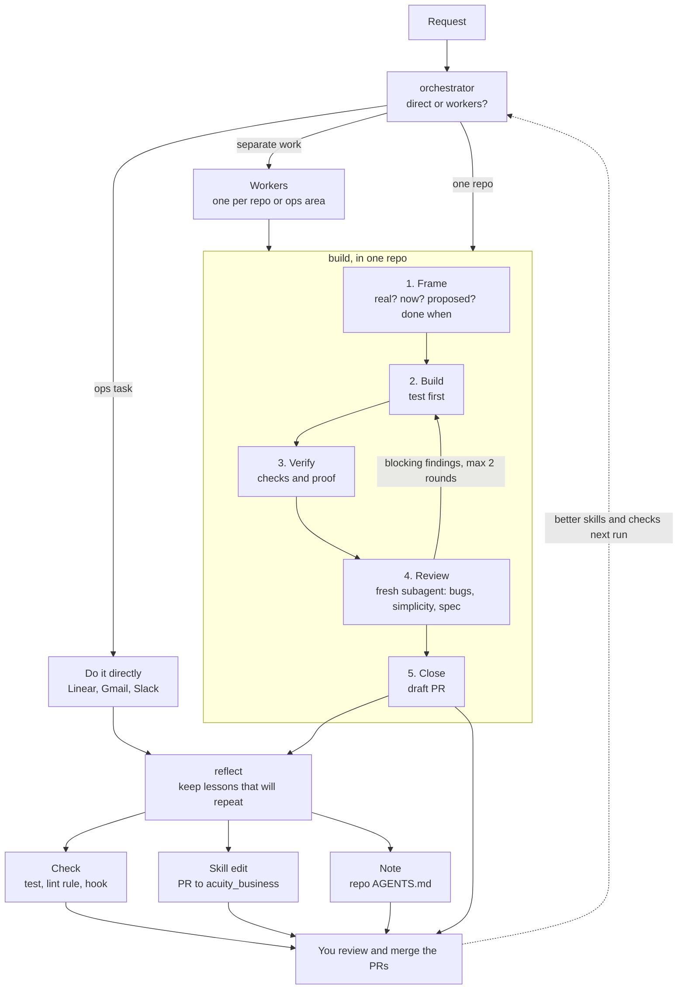

# Acuity Business

The shared operating layer for Acuity Health agents: global working rules and a
small, curated set of skills used from Codex and Claude Code.

## How the skills work


```mermaid
flowchart TD
    REQ["Request"] --> ORC["orchestrator<br/>direct or workers?"]
    ORC -->|"ops task"| OPS["Do it directly<br/>Linear, Gmail, Slack"]
    ORC -->|"one repo"| BUILD
    ORC -->|"separate work"| WRK["Workers<br/>one per repo or ops area"]
    WRK --> BUILD

    subgraph BUILD["build, in one repo"]
        FRAME["1. Frame<br/>real? now? proposed? done when"] --> CODE["2. Build<br/>test first"]
        CODE --> VERIFY["3. Verify<br/>checks and proof"]
        VERIFY --> REVIEW["4. Review<br/>fresh subagent: bugs, simplicity, spec"]
        REVIEW -->|"blocking findings, max 2 rounds"| CODE
        REVIEW --> CLOSE["5. Close<br/>draft PR"]
    end

    OPS --> REFLECT
    CLOSE --> REFLECT["reflect<br/>keep lessons that will repeat"]
    REFLECT --> CHECK["Check<br/>test, lint rule, hook"]
    REFLECT --> SKILL["Skill edit<br/>PR to acuity_business"]
    REFLECT --> NOTE["Note<br/>repo AGENTS.md"]

    CLOSE --> YOU["You review and merge the PRs"]
    CHECK --> YOU
    SKILL --> YOU
    NOTE --> YOU
    YOU -.->|"better skills and checks next run"| ORC
```

| Skill | Job |
|---|---|
| `orchestrator` | Decide direct work or workers, verify proof, close with `reflect`. |
| `build` | Frame, build test-first, verify, fresh-reviewer loop, draft PR. |
| `reflect` | Turn repeating lessons into a check, skill edit, or note, as PRs. |
| `pr` | One PR format for every repo: problem, change, evidence, risk. |
| `acuity-brand-design` | Acuity-branded visuals, decks, and documents. |

Nothing waits for approval mid-run. The PRs are the checkpoint: merging a PR
approves it, closing it rejects it.

## Layout

- `AGENTS.md` — principles for every agent in every repository.
- `skills/` — reusable workflows. Each one earns its place.
- `docs/writing-skills.md` — how to write and change a skill.
- `scripts/validate-skills` — checks skill front matter and size limits.
- `scripts/link-skills` — links rules and skills into both agent runtimes.
- `hooks/` — local guardrails.

## Setup

```bash
git config core.hooksPath hooks
scripts/link-skills
```

`link-skills` links `AGENTS.md` to `~/.codex/AGENTS.md` and `~/.claude/CLAUDE.md`,
links each skill into `~/.codex/skills/` and `~/.claude/skills/`, and removes
stale links to skills that no longer exist. Run it after adding or removing a
skill.
